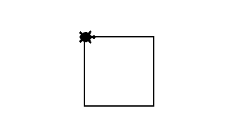

# Quadrado

Bem-vindo à Tartaruga Artista!

Primeiro, vamos tentar fazer um quadrado simples usando os métodos
```turtle.right(90)``` (ou ```turtle.left(90)```) e ```turtle.forward(100)```.
Cada lado deve medir 100 pixels.

## Figura a ser desenhada


## Banco de instruções

```import turtle```

```turtle = turtle.Turtle()```

```turtle.forward(100)```

```turtle.left(90)```

```turtle.right(90)```

[Próximo](02_diamante.md)
