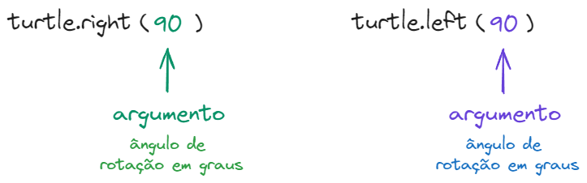
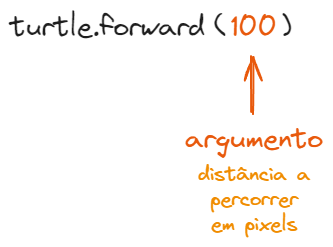

# Diamante

No exercício anterior, os números utilizados em ```turtle.right(90)```, ```turtle.left(90)``` e
```turtle.forward(100)``` são chamados de **argumentos**. 

Em ```turtle.right(90)``` o número **90** indica o ângulo de rotação em graus, bem como em ```turtle.left(90)```.


Já em ```turtle.forward(100)``` o número **100** indica a distância em que irá percorrer em pixels. 


Sabendo disso, desenhe um diamante com ângulos de 120 e 60 graus, e com lados
de 150 pixels de comprimento.

## Figura a ser desenhada


## Banco de instruções

```import turtle```

```esguicho = turtle.Turtle()```

```esguicho.forward(???)```

```esguicho.left(???)```

```esguicho.right(???)```

[Anterior](01_quadrado.md) | [Próximo](03_hexagono.md)
