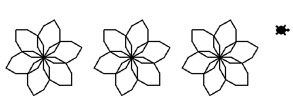

# Flor

Uma função é mais uma ferramenta de programação para que você não tenha que
repetir as mesmas ações. E são definidas com a instrução ```def```. Com elas,
podemos criar novos blocos.

Esta função desenha uma flor, assim, você pode usá-la sempre que quiser fazer
esse desenho.

```python
import turtle

turtle = turtle.Turtle()

# definindo a função
def desenhe_uma_flor():
    for _ in range(6):
        for _ in range(8):
            turtle.forward(20)
            turtle.right(30)
        turtle.right(60)


# chamando a função (apenas na chamada que a função é executada)
desenhe_uma_flor()
```

Use-a para desenhar essas flores juntamente com os novos blocos
```turtle.penup()``` e ```turtle.pendown()```, que levantam e abaixam a caneta
respectivamente. Isso permite a tartaruga movimentar-se sem desenhar. Dica: as
flores são separadas por 150 pixels.

## Figura a ser desenhada


## Banco de instruções

```import turtle```

```turtle = turtle.Turtle()```

```turtle.forward(???)```

```turtle.left(???)```

```turtle.right(???)```

```turtle.penup()```

```turtle.pendown()```

```for _ in range(???):```

```desenhe_uma_flor()```

[Anterior](07_hexagono_de_hexagonos.md) | [Próximo](09_formas.md)

