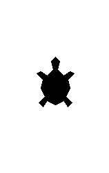

# Novas roupas e tamanhos

As "tartarugas" das aulas anteriores não eram exatamente tartarugas, e sim
setas. Nesta aula, vamos aprender a dar novos formatos e tamanhos para as
nossas tartarugas.

Para mudar o formato da tartaruga, você deve usar o método ```turtle.shape(???)```,
onde ```???``` deve ser substituído por um nome de formato válido e predefinido:
```"arrow"```, ```"turtle"```, ```"circle"```, ```"square"```, ```"triangle"```, ```"classic"```.
Observe que os nomes deverão estar entre aspas.

Já para mudar o tamanho do tartaruga, você deve usar o método ```turtle.shapesize(???)```,
onde ```???``` deve ser substitudo por um número inteiro.

Teste formatos e tamanhos diferentes.

## Figura a ser "desenhada"


## Banco de instruções

```import turtle```

```tortuguita = turtle.Turtle()```

```tortuguita.shapesize(???)```

```tortuguita.shape(???)```

[Próximo](02_????.md)
