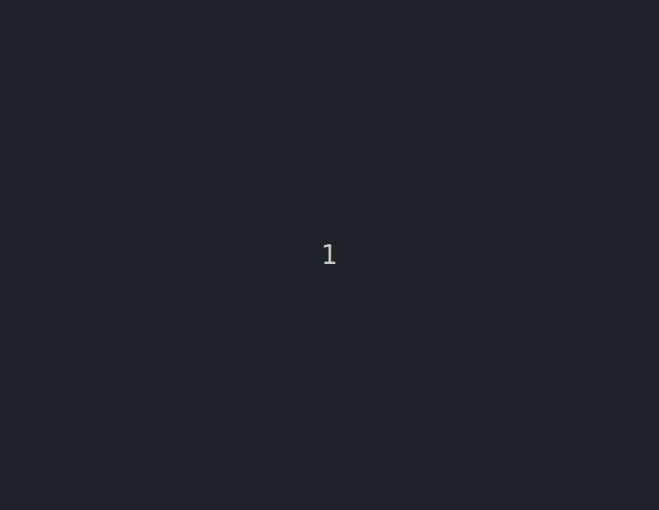

# Uma tartaruga escritora e contadora de tempo

A partir dessa lição iremos lidar com passagem de tempo. Aprenderemos
agora a como fazer essa contagem e também como ter uma tartaruga escritora
para nos mostrar esse tempo.

Copie o código e execute o código abaixo antes de prosseguir.

```python linenums
import turtle

# Inicializa a tartaruga escritora
escritora = turtle.Turtle()
escritora.goto(-400, 400)
escritora.tempo = 0
escritora.write('Contagem ainda não começou.', font=('Arial', 20, 'bold'))


# Define função que irá contar a passagem do tempo e
# escrever esse tempo na tela
def atualiza_tempo():
    escritora.clear()
    escritora.write(f'Compasso: {escritora.tempo}', font=('Arial', 20, 'bold'))

    escritora.tempo = escritora.tempo + 1

    turtle.ontimer(atualiza_tempo, 1000)


# Registra que a função atualiza_tempo será chamada após 1000 milissegundos
turtle.ontimer(atualiza_tempo, 1000)

turtle.mainloop()
```

O código já possui alguns comentários e está dividido em três blocos principais.
Vamos detalha-los.

O primeiro trecho é responsável por inicializar a tartaruga escritora.
Depois de criar a tartaruga (```escritora = turtle.Turtle()```), conforme já feito
anteriormente, utilizamos um novo método de movimento: ```escritora.goto(???, ???)```.
Os parâmetros do método são coordenadas dos pontos na tela. Mude-os para ver o que acontece.

Depois, criamos uma variável associada ao objeto `escritora`, que armazenará o tempo
decorrido para ser exibido. Por fim, utilizamos um novo método que é de fato quem escreve
algo na tela: ```escritora.write(???, ???)```. O primeiro parâmetro é o texto a ser exibido
e o segundo é a formatação da fonte. Neste caso, estamos usando a fonte Arial, tamanho 20
e negrito.

O segundo bloco é definição da função ```atualiza_tempo``` que será chamada para
atualizar o tempo *e* também escrever o tempo na tela. Voltaremos para analisar o
conteúdo dela logo mais. Vamos agora saltar para o terceiro bloco.

O terceiro bloco contém apenas uma linha: o registro de que a função
```atualiza_tempo``` será chamada após 1000 milissegundos (ou 1 segundo).
Observe que a função está sendo passada como parâmetro para a função ```turtle.ontimer```
e que nessa passagem não utilizamos os parênteses, pois a função não deve ser 
executada agora, somente em algum momento no futuro.

Voltando para a análise da função ```atualiza_tempo```, na primeira linha damos
a instrução para que a ```escritora``` limpe (```clear```) tudo que ela tenha
feito na tela, tanto os caminhos percorridos, quanto o que que foi escrito com
```write```. (Limpar o que foi escrito anteriormente é particularmente
necessário para que não haja sobreposição das escritas. Você pode verificar
essa sobreposição removendo a execução do método ```escritora.clear()```.)
Depois escrevemos na tela o tempo atualizado. Observe o formato do primeiro
parâmetro da função ```escritora.write```. Veja que ele começa com a letra `f`.
O que nos permite inserir variáveis no texto entre `{ }`. Com isso,
`{escritora.tempo}` é um local de substituição pela variável do objeto.

Como essa função será executada várias vezes, precisamos então atualizar o
tempo que a ```escritora``` armazena, o que fazemos com a linha
```escritora.tempo = escritora.tempo + 1```. Aqui, nós lemos o valor da variável,
somamos com 1 e depois guardamos na própria variável para ser lido novamente no futuro.

Por fim, usamos ```turtle.ontimer``` para registrar que a função
```atualiza_tempo``` será executada novamente daqui a 1000 milissegundos (ou 1 segundo).
Veja que no código existen duas chamadas a ```turtle.ontimer``` e que além disso essa
função será executa várias vezes, tal qual a função ```atualiza_tempo```. Isso é
necessário pois ela significa `execute a função *daqui* a X milissegundos` e não
`execute a função *a cada* X milissegundos`. Tenha atenção com isso.

Você poderá usar o trecho de código acima nos exercícios que faremos daqui para
frente, pois iremos trabalhar com ações que ocorrerão após uma passagem de
tempo. Pode ser útil para você acompanhar essa passagem.

## Resultado esperado



[Anterior](01_novas_roupas.md) [Próximo](03_dancarina.md)
