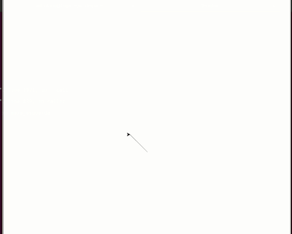

# Uma tartaruga dançarina

Vamos começar as danças. O código abaixo cria uma tartaruga dançarina, mas que
por enquanto ela apenas balança para os lados. Copie e execute.

```python linenums
import turtle

## Configuracao da escritora ## 
# Inicializa a tartaruga escritora
escritora = turtle.Turtle()
escritora.goto(-400, 400)
escritora.tempo = 0
escritora.write('Contagem ainda não começou.', font=('Arial', 20, 'bold'))

# Define função que irá contar a passagem do tempo e
# escrever esse tempo na tela
def atualiza_tempo():
    escritora.clear()
    escritora.write(f'Compasso: {escritora.tempo}', font=('Arial', 20, 'bold'))
    escritora.tempo = escritora.tempo + 1
    turtle.ontimer(atualiza_tempo, 1000)

# Registra que a função atualiza_tempo será chamada após 1000 milissegundos
turtle.ontimer(atualiza_tempo, 1000)


## Configuracao da dançarina ##

# Inicializa a tartaruga dançarina
dançarina = turtle.Turtle()
dançarina.shape('turtle')
dançarina.shapesize(5)
dançarina.setheading(90)

# Funções que em conjunto faz a dançarina dançar
def mexe_direita():
    dançarina.setheading(95)
    turtle.ontimer(mexe_esquerda, 200)    

def mexe_esquerda():
    dançarina.setheading(85)
    turtle.ontimer(mexe_direita, 200)

def move_direita():
    dançarina.setx(10)
    turtle.ontimer(move_esquerda, 200)    

def move_esquerda():
    dançarina.setx(-10)
    turtle.ontimer(move_direita, 200)

turtle.ontimer(mexe_esquerda, 4000)

turtle.mainloop()
```

As responsáveis pelo balanço são as funções `mexe_direita` e `mexe_esquerda`.
Cada uma delas mexe a cabeça da tartaruga para um lado e depois executa
`turtle.ontimer` passando como parametro a outra função para que ela seja
executada depois. Embora cada uma das funções chame a outra pra continuar
o momento, ele precisa ser inicializado. Neste caso, balanço começa após
4 segundos, conforme a linha `turtle.ontimer(mexe_esquerda, 4000)`.

Já as responsáveis pelo movimento lateral são as funções `move_direita` e
`move_esquerda`. Embora internamente cada uma dessas funções adicione a outra
para ser executada depois com `turtle.ontimer`, não há uma chamada inicial da
mesma forma que foi feito com as funções de balanço.

Sua tarefa será fazer com que a tartaruga comece esse movimento lateral após
6 segundos.

## Resultado esperado


## Banco de instruções

```move_esquerda```

```move_direita```

```turtle.ontimer(???, ???)```

[Anterior](02_escritora.md) [Próxima](04_palco_que_brilha.md)
