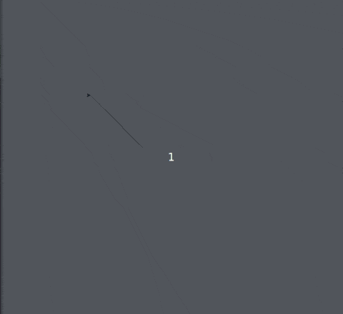

# Dançando pelo palco

A dançarina dança, mas não sai do lugar. Vamos fazer com que ela deslize pelo
palco.

A função abaixo é capaz de selecionar aleatoriamente uma nova posição no palco
dentre uma lista de opções e depois faz a tartatura movimentar-se para esta
nova posição.

```python 
def movimenta():
    import random

    posicoes = [-200, -100, 0, 100, 200]
    novo_x = random.choice(posicoes)
    novo_y = random.choice(posicoes)
    dançarina.goto(novo_x, novo_y)

    turtle.ontimer(movimenta, 2000)
```

Você deverá implementá-la no código do exercício anterior e depois deverá
chama-lá para que de fato a dançarina deslize pelo palco. És capaz de fazer
isso? O movimento da tartaruga deve começar após 2 segundos.

Extra: por padrão, quando uma tartaruga se movimenta, ela deixa um rastro, pois
sua caneta está abaixada, tocando no "papel". Você pode ordernar que a tartaruga
levante sua caneta com o método ```turtle.penup()```. Utilize caso não deseje
ver os rastros da tartaruga.

## Resultado esperado


## Banco de instruções

```dançarina.penup```

```movimenta```

```turtle.ontimer(???, ???)```


[Anterior](04_palco_que_brilha.md) [Próxima](06_???.md)
