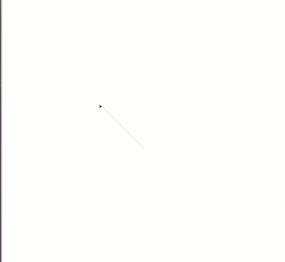

# Mais dançarinas

Precisamos de mais dançarinas.

Você já sabe que as linhas abaixo criam e fazem a configuração inicial da
tartaruga. A partir deles, crie uma outra tartaruga chamada `apoio`.

```python 
dançarina = turtle.Turtle()
dançarina.shape('turtle')
dançarina.shapesize(5)
dançarina.setheading(90)
```

Como as tartarugas são criadas sempre no centro, você deverá movê-la
para a esquerda ou para a direita. Use o método `turtle.setx(???)` para isso.
Além disso, você também deve definir que a tartaruga de apoio dance. Lembre-se
de que isso deve ser feito nas funções `mexe_direita()` e `mexe_esquerda()`.

## Resultado esperado


## Banco de instruções

```apoio = turtle.Turtle()```

```apoio.shape(???)```

```apoio.shapesize(???)```

```apoio.setheading(???)```

```apoio.setx(???)```

[Anterior](05_dancando_pelo_palco.md) [Próxima](07_propriedades_tamanho.md)
