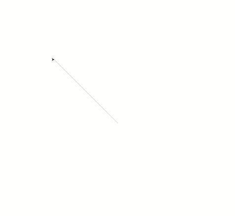

# Propriedades: cor

Os dançarinos também tem uma propriedade de cor, que é definida com o método
`turtle.color(???)`.

Tente alterar a cor de todos os seus dançarinos. 

Veja os nomes de cores válidos em: https://pt.wikipedia.org/wiki/Lista_de_cores
(coluna Nome Web)

## Resultado esperado


## Banco de instruções

```apoio = turtle.Turtle()```

```apoio.color(???)```

```apoio.shape(???)```

```apoio.shapesize(???)```

```apoio.setheading(???)```

```apoio.setx(???)```

```apoio.setx(???)```

[Anterior](07_propriedades_tamanho.md) [Próxima](09_???.md)
