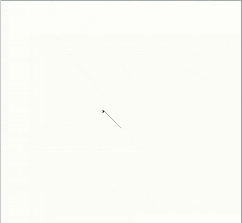

# Mais eventos

Além da passagem de tempo, as tartarugas podem executar ações em respostas a
outros tipos de eventos.

Por exemplo, o bloco `turtle.onkey(ação, 'Up')` faz com que `ação` seja
executada quando a seta para cima (`Up`) for pressionada.

Portanto, para fazer com que as tartaturas de apoio andem para frente
(`turtle.forward(???)`) deverá implementar a função que faz este movimento,
conforme abaixo:

```python
def passo_cima():
    apoio_um.forward(30)
    apoio_dois.forward(30)
```

E também indicar que essa função será executado quando a seta para cima (`Up`)
for pressionada, conforme abaixo:

```python
turtle.onkey(passo_cima, 'Up')
```

Além disso, deverá ativar a escuta (`listen`) de eventos do `turtle`. Ao final
do seu código (antes do `turtle.done()`), acrescente o seguinte bloco:

```python
turtle.listen()
```

Depois, acrescente outras ações em respostas as demais setas de direção:
baixo (`Down`), esquerda (`Left`) e direita (`Right`). Observe que deve
estar entre aspas e seguir exatamente a caixa (letras minúsculas ou maiúsculas).

Você pode mudar o passo de dança, alterar as propriedades de um(a) dançarino(a)
ou fazer um movimento rápido apenas uma vez. Use a criatividade, combine blocos
já conhecidos e procure novos blocos!

## Resultado esperado


## Banco de instruções

```apoio = turtle.Turtle()```

```apoio.backward(???)```

```apoio.color(???)```

```apoio.forward(???)```

```apoio.shape(???)```

```apoio.shapesize(???)```

```apoio.setheading(???)```

```passo_cima()```

```para_tras()```

```turtle.listen()```

```turtle.onkey(???, ???)```

```turtle.ontimer(???, ???)```


[Anterior](09_frente_fundo.md) [Próxima](11_???.md)
