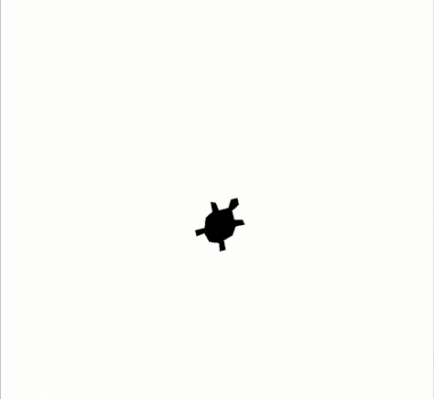

# Concurso de dança

É hora do concurso de dança!

Com o código abaixo, a dançarina da esquerda dá um passo de dança quando você
pressiona a tecla de seta para a esquerda.

Faça a dançarina da direita fazer o mesmo movimento quando pressionada a tecla
da seta para a direita.

Faça também uma das dançarinas dar um pulo quando a tecla de seta para cima for
pressionada.

```python
import turtle

## Configuracao da dançarina ##

# Inicializa a tartaruga dançarina
esquerda = turtle.Turtle()
esquerda.shape('turtle')
esquerda.shapesize(5)
esquerda.setheading(90)
esquerda.setx(-150)
esquerda.color("blue")

# Inicializa a tartaruga dançarina
direita = turtle.Turtle()
direita.shape('turtle')
direita.setheading(90)
direita.setx(150)
direita.shapesize(5)
direita.color("green")

# Funções que em conjunto fazem as dançarinas dançarem
def mexe_direita():
    esquerda.setheading(95)
    direita.setheading(95)
    turtle.ontimer(mexe_esquerda, 200)

def mexe_esquerda():
    esquerda.setheading(85)
    direita.setheading(85)
    turtle.ontimer(mexe_direita, 200)

def passo_esquerda():
    esquerda.setx(-200)
    esquerda.setx(-100)
    esquerda.setx(-150)

turtle.ontimer(mexe_esquerda, 0)

turtle.onkey(passo_esquerda, 'Left')
turtle.onkey(lambda: None, 'Right')
turtle.onkey(lambda: None, 'Up')

turtle.listen()
turtle.done()

```

Observe que o mapeamento das teclas de seta direta e cima (`Right` e `Up`,
respectivamente) já estão feitas com `turtle.onkey(???, ???)`. Entretanto,
como as funções ainda não existem (você deverá implementá-las), as teclas
foram mapeadas para `lambda: None`, que nada fez, mas evita um erro de sintaxe
durante a execução do código, basta substituir isso pelo nome da função.

## Resultado esperado


## Banco de instruções

```dançarina.setx(???)```

```dançarina.sety(???)```

```passo_esquerda()```

```turtle.onkey(???, ???)```

```turtle.ontimer(???, ???)```


[Anterior](10_mais_eventos.md) [Próxima](12_???.md)
