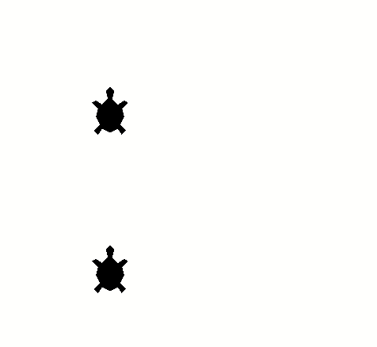

# Grupo de dançarinas

Ás vezes, queremos que todas as dançarinas presentes no palco executem um passo
sincronizado. Além disso, muitas vezes nem sempre sabemos os nomes das dançarinas,
apenas queremos dizer algo como "todas vocês, dêem um passo pra direita".

Veja no código abaixo a função `cria_dancarinas()`. Inicialmente, criamos
a variável `posicoes` que conterá 4 pares de coordenadas `(x, y)`. Depois,
percorremos esse conteiner com o bloco `for posicao in posicoes:` e para cada
posição criamos uma dançarina com `t = turtle.Turtle()` e a enviamos para a
posição, além de outras configurações.

Depois, nas funções `mexe_direita()` e `mexe_esquerda()` recuperamos a lista
de dançarinas com `turtle.turtles()` e, combinando com o bloco `for ... in ...:`,
uma-a-uma damos a instrução desejada.

```python
import turtle

## Configuração das dançarinas ##
def cria_dancarinas():
    posicoes = (-200, 200), (-200, -200), (200, 200), (200, -200)
    for posicao in posicoes:
        t = turtle.Turtle()
        t.penup()
        t.goto(posicao)
        t.shape('turtle')
        t.shapesize(5)
        t.setheading(90)

# Funções que em conjunto fazem as dançarinas dançarem
def mexe_direita():
    for t in turtle.turtles():
        t.setheading(95)

    turtle.ontimer(mexe_esquerda, 200)

def mexe_esquerda():
    for t in turtle.turtles():
        t.setheading(85)

    turtle.ontimer(mexe_direita, 200)


cria_dancarinas()

turtle.ontimer(mexe_esquerda, 0)

turtle.done()
```

Faça as dançarinas daremos passos para cima (`turtle.forward(???)`),
passos para baixo (`turtle.backward(???)`) e depois voltar a posição
inicial. Este movimento deve começar após 500 milissegundos e
continuar indefinidamente.

Não esqueça da indentação.

## Resultado esperado


## Banco de instruções

`def ???():`

`for t in turtle.turtles():`

`t.forward(???)`

`t.backward(???)`

`t.setheading(???)`

`turtle.ontimer(???, ???)`

[Anterior](11_concurso_danca.md) | [Próxima](12_???.md)
