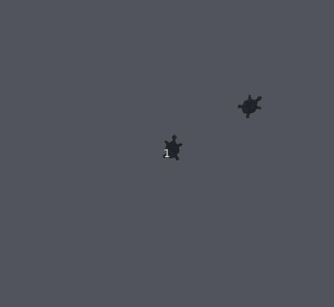

# Entre no ritmo

Agora use sua criatidade e crie sua própria dança. Você pode partir do código
abaixo que já cria um palco com uma dançarina principal e algumas dançarina de
apoio.

Além de utilizar os métodos estudados e as funções já criadas,
você pode desejar descobrir novos métodos para as tartaruras dançarinas.
Para tanto, consulte a [documentação oficial do módulo Turtle](https://docs.python.org/pt-br/3/library/turtle.html).

```python
import turtle

## Configuração das dançarinas ##
def cria_dancarinas_apoio():
    quantidade_de_dancarinas = 7
    posicao_base = 360/quantidade_de_dancarinas
    for q in range(quantidade_de_dancarinas):
        t = turtle.Turtle()
        t.penup()
        t.shape('turtle')
        t.shapesize(3)
        t.setheading(posicao_base*(q+1))
        t.forward(300)
        t.posicao_base =  t.heading()

# Funções que em conjunto fazem as dançarinas dançarem
def mexe_direita():
    for t in turtle.turtles():
        t.setheading(t.posicao_base+5)

    turtle.ontimer(mexe_esquerda, 200)

def mexe_esquerda():
    for t in turtle.turtles():
        t.setheading(t.posicao_base-5)

    turtle.ontimer(mexe_direita, 200)


cria_dancarinas_apoio()

# Inicializa a dançarina principal
principal = turtle.Turtle()
principal.posicao_base = 90
principal.shape('turtle')
principal.shapesize(5)
principal.setheading(principal.posicao_base)
principal.color('blue')

turtle.ontimer(mexe_esquerda, 0)

turtle.mainloop()
```

## Palco atual



[Anterior](12_grupo_dancarinas.md)
