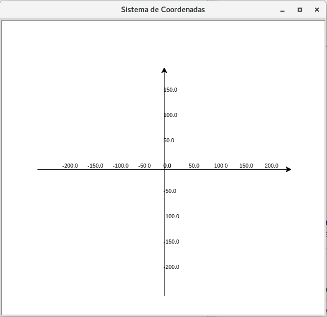

# Movimentação

Antes de colocarmos nossas tartarugas para desenharem, precisamos entender como
elas estão localizadas na tela de desenho, comumente chamada de canvas.

Existe um sistema de coordenadas, com **posições x** e **y**, em que sua origem
(ponto onde x=0 e y=0) está localizada no centro do canvas, como apresentado na
figura abaixo. 



É através desse sistema que iremos mover as nossas tartarugas. Observe os valores
mínimos e máximos apresentados na imagem são ilustrativos. Potencialmente, tendem
ao infinito, porém poderão na aparecer na tela.

Todas as tartarugas que criamos (sim, é possível termos mais de uma tartaruga)
estarão inicialmente localizadas na origem e estarão sempre direcionadas para
a direita.

Para executar os exemplos a seguir, abra o interpretador Python no modo interativo
e inicialize uma tartaruga. 

```python
>>> import turtle
>>> turtle = turtle.Turtle()
```

## Métodos de movimentação

Alguns momentos de movimentação já foram amplamente utilizados em exercícios 
anteriores (ou quase):

- ```forward(distance)``` 

```python
>>> turtle.forward(200)
```

- ```backward(distance)```

```python
>>> turtle.backward(200)
```

- ```right(angle)```

```python
>>> turtle.right(90)
>>> turtle.forward(200)
```

- ```left(angle)```

```python
>>> turtle.left(180)
>>> turtle.forward(200)
```

Se todos os comandos foram executados corretamente, você tem uma meia cruz, como
da imagem abaixo. Você é capaz de completa-lá?


Todos esses são relativos à posição atual da tartaruga, sendo a posição e direção
finais um consequência disso e dos argumentos informados (distância ou ângulo de
rotação).
 
Outros métodos tem um caráter mais absoluto. Posição e direção finais serão
independentes das valores iniciais, ao menos em partes, em alguns casos.

- ```setx(x)```

```python
>>> turtle.setx(200)
```

- ```sety(y)```

```python
>>> turtle.sety(100)
```

- ```goto(x, y=None)```

```python
>>> turtle.goto(0, 0)
```

- ```setheading(to_angle)```

```python
>>> turtle.setheading(45)
>>> turtle.forward(100)
```

Você é capaz de levar a tartaruga de volta à posição e orientação iniciais (ponto x=0 e y=0 e direcionada para direita) usando os métodos ```goto()``` e ```setheading()```?

Faça mais alguns movimentos e rotações com a tartaruga e tente descobrir o que faz o
método ```home()```. 

- ```home()```
```python
>>> turtle.home()
```

Se conseguimos definir posição e direção, então também podemos ler o **estado**
da tartaruga.

- ```xcor()```
- ```ycor()```
- ```position()```
- ```heading()```
- ```towards(x, y=None)```
- ```distance(x, y=None)``` 


## Referências

[Módulo Turtle - Desenhando com a programação](https://medium.com/reflex%C3%A3o-computacional/m%C3%B3dulo-turtle-d8949db55008)

[Próximo](02_desenho.md)
