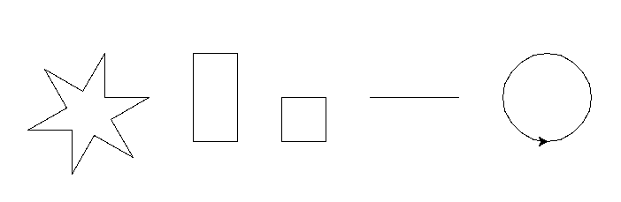
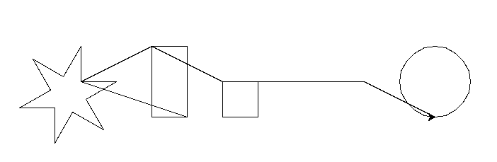

# Caneta

**Desafio** Utilizando as funções da sessão anterior, e com o auxílio dos 
métodos vistos anteriormente, desenhe várias figuras.

O resultado deverá ser algo semelhante à imagem abaixo (ordem, posicionamento e 
tamanho são irrelevantes. o importante é ter 5 figuras).



Conseguiu? Ou seu desenho ficou mais parecido com o abaixo? Com linhas entre
as figuras?



Se isso aconteceu, foi porque você não levantou a caneta - como faria se 
estivesse fazendo as figuras manualmente em papel - quando moveu a tartaruga 
para posicioná-la no lugar em que deveria desenhar cada figura.

Além de métodos para manipular a tartaruga, também são providos métodos para 
manipular a caneta que a tartaruga carrega e usa para fazer os desenhos.

- ```penup()```

```python
>>> turtle.penup()
>>> turtle.forward(100)
```

Perceba que a tartaruga se moveu, mas não desenhou. Pois a caneta estava 
levantada.

- ```pendown()```

```python
>>> turtle.pendown()
>>> turtle.forward(100)
```

Agora, a linha foi desenhada. Pois a caneta estava abaixada.

Também existe um método para consultar se a caneta está abaixada:

- ```isdown()```
```python
>>> turtle.pendown()
>>> turtle.isdown()
True
>>> turtle.penup()
>>> turtle.isdown()
False
```

Você também pode querer mudar a largura ou a cor da caneta.

- ```pensize(width=None)```
- ```pencolor(*args)```

```python
>>> turtle.pendown()
>>> turtle.pensize(10)
>>> turtle.pencolor('red')
>>> turtle.forward(100)
>>> turtle.pensize(20)
>>> turtle.pencolor('green')
>>> turtle.forward(100)
```

Por fim, existe um método que serve para obter o **estado** completo da caneta,
se chamado sem nenhum argumento, ou alterar o valor de algum **atributo**.

- ```pen(pen=None, **pendict)```

```python
>>> turtle.pen()
{'shown': True, 'pendown': True, 'pencolor': 'black', 'fillcolor': 'black',
'pensize': 20, 'speed': 3, 'resizemode': 'noresize', 'stretchfactor': (1.0, 1.0),
'shearfactor': 0.0, 'outline': 1, 'tilt': 0.0}
>>> turtle.pen(pencolor='blue', pensize=5)
>>> turtle.forward(50)
>>> turtle.pen()
{'shown': True, 'pendown': True, 'pencolor': 'blue', 'fillcolor': 'black', 
'pensize': 5, 'speed': 3, 'resizemode': 'noresize', 'stretchfactor': (1.0, 1.0), 
'shearfactor': 0.0, 'outline': 1, 'tilt': 0.0}
```

Observe como os atributos ```pensize``` e ```pencolor``` da última execução são
diferentes da primeira. Além de ser possível notar a diferença no canvas ao mover
a tartaruga.

[Anterior](02_desenho.md) | [Próximo](04_respondendo_eventos.md)
