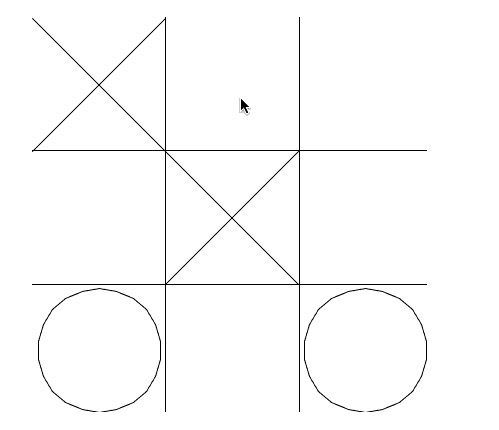

# A biblioteca freegames

Como já apresentado anteriormente, além de possuir os jogos, o Free Python Games
também inclui uma biblioteca com alguns utilitários úteis. Por isso, que após
instalado o pacote `freegames`, podemos executar a importação abaixo no Python:

```python
>>> import freegames
```
 
Abra o seu intepretador Python para executar este e os demais exemplos.

Os utilitários da biblioteca `freegames` podem ser organizados em 3 categorias:
1. Funções de desenho
1. Funções auxiliares
1. Vetores

## Funções de desenho

- freegames.line(a, b, x, y)

Desenha uma linha do ponto `(a, b)` até o ponto `(x, y)`.

```python
>>> freegames.line(10, 10, 100, 100)
```

- freegames.square(x, y, size, name)

Desenha um quadrado a partir do ponto `(x, y)` com lado de tamanho `size` e
preenchido com cor de nome `name`. O quadrado é direcionado para a direita e
para cima.

```python
>>> freegames.square(-50, 20, 100, 'blue')
```

## Funções auxiliares

Considere a grade de um Jogo-da-Velha abaixo:



Perceba que é preciso identificar a área clicada para fazer a jogada
(preencher com x ou bola), porém quando o evento de clique ocorre (registrado
pelo `onscreenclick`) o que se tem é apenas as coordenadas `x` e `y`, sendo
necessários alguns cálculos para se identificar a àrea clicada, e de forma mais
específica o ponto da tela em que o desenho deve começar.  

Imagine que para desenhar a grade, é feito um **deslocamento** para a esquerda
de 100 e que cada casa tem um **tamanho** de 100. Portanto, o lado esquerdo mais
extremo das casas serão: -100, 0 e 100. Assim, os **valores** que identificam a 
casa clicada estão em intervalos que são:
- Casa esquerda: valores de -100 a -1
- Casa do meio: valores de 0 a 99
- Casa da direita: valores de 100 a 199

Para facilitar esses cálculos a biblioteca provê a função `floor`.

- freegames.floor(value, size, offset=200)

Retorna o piso do valor `value`, dado um tamanho `size` e deslocamento `offset`. 

Essa função é melhor compreendida com o diagrama da reta numérica:

```python
        -200  -30   140   310   480
<----a----|--b--|--c--|--d--|--e--|----f---->
```

O diagrama mostra um deslocamento de 200 (parâmetro `offset` da função), indicado
pelo valor -200 mais a esquerda, e um tamanho de 170 (parâmetro `size` da função),
denotado pelas distâncias entre -200 e -30, e todas as outras  distâncias entre dois 
pontos adjacentes indicados no diagrama. 

Já o parâmetro `value` está representado no diagrama pelas letras `a`, `b`,
`c`, `d` e `f`. Quaisquer que seja o valor desse parâmetro, para essa configuração,
o retorno da função será o ponto identificado à esquerda.
Ou seja `floor(b)` é -200, `floor(c)` é -30 e assim por diante. Considere ainda
que a reta é virtualmente infinita para ambos os lados e os marcos continuam se
repetindo a cada 170.

Veja, e execute, alguns exemplos concretos:

```python
>>> freegames.floor(-170, 170, 200)
-200.0
>>> freegames.floor(-31, 170, 200)
-200.0
>>> freegames.floor(-30, 170, 200)
-30.0
>>> freegames.floor(310, 170, 200)
310.0
>>> freegames.floor(410, 170, 200)
310.0
>>> freegames.floor(510, 170, 200)
480.0
```

## Vetores

Em breve...

## Referências

[Anterior](02_fpg_paint.md) | [Próximo](03_freegames.md)