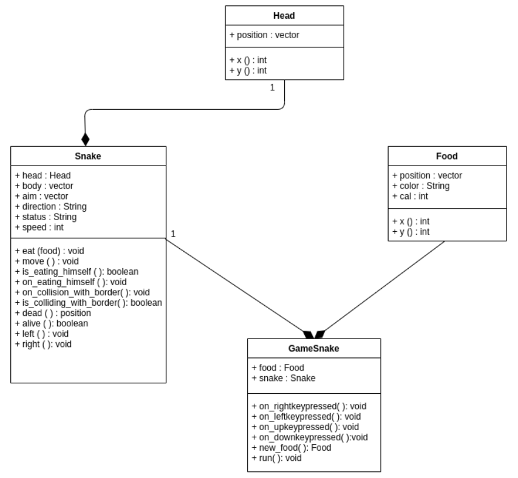

# Snake Orientado a Objetos

Um dos motivos para não ter sido utilizados POO nos jogos de Free Python Games
é não ter havido necessidade, por tratarem de jogos com **requisitos** simples.
Assim, começaremos discutindo o código atual, mas expandindo os requisitos, para
que faça mais sentido a utilização de classes e objetos. Quando apresentarmos
a versao do jogo em OO, você perceberá inclusive que os exercícios propostos são
diferentes da versão original.

## Variáveis 

No `Snake` foram definidas apenas 3 variáveis, conforme o trecho:

```python
food = vector(0, 0)
snake = [vector(10, 0)]
aim = vector(0, -10)
```

Embora os nomes das variáveis indiquem a sua utilidade, seus tipos são
genéricos: `vector`, e que na verdade, representando unicamente a posição
desse elemento. Consequentemente, excetuando as operações de manipulação
de vetores que estão encapsuladas nessa classe, diversas outras operações
mais pertinentes do jogo estão espalhas no código.

Neste caso, essas variáveis poderiam ser das seguintes classe:

- food: `Food`. Além de encapsular sua posição, poderia ter um atributo de
*energia*. A depender do nível de energia, a cobra poderia crescer mais ou 
menos ou ainda termos uma classe `BadFood`, onde a cobrar poderia diminuir 
de tamanho.

- snake: `Snake`. Além de encapsular sua posição poderia também encasular
operações tais como: comer uma fruta, movimentar-se, mudar direção.
Também poderia possuir uma pontuação. Imagine um jogo com mais de uma cobra,
cada uma delas teria uma pontuação diferente.

- aim: este poderia ser mesmo um `vector`, pois indica apenas para onde
a cobra se move. Porém, perceba que isso diz respeito à própria cobra,
portanto deveria ser um atributo da classe `Snake`.

Mesmo sem esses novos requisitos (energia e diferentes de comida, jogo com
múltiplos jogadores), POO ainda poderia ter sido utilizado. Contudo, a 
necessidade e consequente benefício seriam menores.

## Funções

O código de `Snake` possui 3 funções. Duas delas são bem simples e fazem uma 
única coisa, enquanto uma outra é a função que contém o ciclo principal do jogo
e dentro dele acontece muita coisa.

### Funções change e inside

As funções `change` e `inside` foram definidas conforme a seguir:

```python
def change(x, y):
    """Change snake direction."""
    aim.x = x
    aim.y = y


def inside(head):
    """Return True if head inside boundaries."""
    return -200 < head.x < 190 and -200 < head.y < 190
```

Observe que a função `change` é responsável por atualizar a variável `aim` que,
como já tido, indica a direção para o qual a cobrinha está se movendo. Portanto,
essa atualização é algo que deveria estar na classe `Snake`. Além disso, na
perspectiva da cobra ela se movimenta em apenas duas direções: esquerda e 
direita. Assim, poderíamos ter na classe dois métodos responsável por essa 
mudança de direção, além claro de uma terceira responsável pelo movimento em si.

Com isso, uma **interface** inicial para essa classe seria algo como:

```python
class Snake:
    def move():
        pass
    
    def left():
        pass
    
    def right():
        pass
```

Em relação a `inside`, podemos ter abordagens diferentes. Perceba que são 
necessários dois tipos de parâmetros para definir se a cobra está ou não
dentro da área definida: as dimensões da área, que no código em questão estão
fixos, e a posição da cabeça da cobra em si. Se você deixa fora da classe `Snake`
poderá quebrar o encapsulamento, se você coloca dentro da classe, não faz sentido
a cobra "saber" as dimensões da área de jogo. Uma forma de contornar essas 
questões é a classe `Snake` possuir um método que receba como argumentos as 
dimensões da área. A interface da classe pode ser atualizado com o seguinte
método:

```python
...
    def inside(self, x1, y1, x2, y2):
        pass
```

onde os pares `(x1, y1)` e `(x2, y2)` representam o ponto superior esquerdo e
o ponto inferior direito, respectivamente.

### Funções move

A função `move` possui uma string de documentação que diz o seguinte:

```python
"""Move snake forward one segment."""
```

Porém, ela faz muito mais coisa que apenas mover a cobra em um segmento:

- Mover a cobra:

```python
head = snake[-1].copy()
head.move(aim)
```

- Verificar se está colidindo com a borda e, se sim, "matar" a cobra e parar
o jogo:

```python
if not inside(head) or head in snake:
        square(head.x, head.y, 9, 'red')
        update()
        return
```

- Crescer a cobra:

```python
snake.append(head)
```

- Verificar a cobra está comendo:

```python
if head == food:
        print('Snake:', len(snake))
        food.x = randrange(-15, 15) * 10
        food.y = randrange(-15, 15) * 10
else:
    snake.pop(0)
```

- Atualizar a tela

```python
clear()

for body in snake:
    square(body.x, body.y, 9, 'black')

square(food.x, food.y, 9, 'green')
update()
```

- Repetir todo esse processo até o jogo acabar

```python
ontimer(move, 100)
```

Perceba que mover, comer, crescer (ou diminuir), morrer,
mudar direção, etc. são ações da cobra, assim todas essas 
ações deveriam estar encapsuladas em `Snake`.  

Além disso, uma outra classe `SnakeGame` poderia surgir.
Essa classe seria **composta**  por pelo menos uma comida
e uma cobra, sendo responsável por chamadas a métodos dessas
classes e por usar `turtle` para desenhar o jogos.

## Diagrama de classes

É comum utilizarmos representações gráficas de um sistema.
Uma das representações possíveis é através de diagramas de 
classes. Esse diagrama fornece uma representação estrutural de 
como as classes se relacionam.

Consideram o discutido assim, e após algumas iterações de 
desenvolvimento, portanto não está 100% fiel ao que colocamos,
foi criado uma versão orientada a objetos do jogo `Snake`,
cujo diagrama de classes pode ser visto abaixo:




O código está disponível junto com a tradução da documentação
https://ifrn.github.io/free-python-games/pt_BR/ 

## Exercícios


[Anterior](05_poo_jogos.md) | [Próximo](06_poo_pacman.md)
