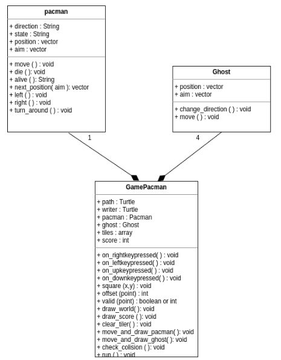

# Pacman Orientado a Objetos

Assim como para `Snake`, foi feito uma análise do código da versão estruturada de
Pacman, identificando suas variáveis e funções relacionadas. Dessa análise, foram
identificadas classes que melhor representariam os conceitos deste jogo. Das
variáveis existentes, duas merecem destaque:

- pacman: essa variável na versão estruturada é um `vector`, mas poderia
ser um `Pacman`. Além de encapsular sua posição e operações relacionadas, a classe
poderia conter tanto outros atributos (como direção e estado - vivo ou morto)
quanto ações de mais alto nível, ou seja, ações pertinentes a um `Pacman` e não
a um `vector`, tais como morrer, virar para esquerda ou direita, calcular a próxima
posição.
- ghosts: essa variável é uma lista de `vector`, mas poderia ser uma lista de
`Ghost`. Para os fantasmas são necessários apenas duas ações: mover
e mudar de direção, além de possuir os atributos de posição e direção.

Além de uma classe `GamePacman` que faria a orquestração das classes anteriores
e desenho e atualização da tela. Essa classe conteria, principalmente mas não
só isso, as ações feitas na função `move` da versão estruturada, mas distribuídas
em diversos métodos.

## Diagrama de classes

Considerando o apresentado acima, e após algumas iterações de desenvolvimento, foi
criada uma versão orientada a objetos do jogo `Pacman`, cujo diagrama de classes
pode ser visto abaixo:

O código está disponível junto com a tradução da documentação
https://ifrn.github.io/free-python-games/pt_BR/

## Exercícios

Resolva os exercícios presentes no código do `Pacman`, cuja traduções seguem
abaixo:

1. Mova a variável/atributo `score` para a classe `Pacman`. Esse atributo deverá
agora ser incrementado por um novo método no código de `Pacman`. Altere
`draw_score` com as mudanças necessárias em  `GamePacman`.
2. Crie uma novo atributo `speed` e faça as mudanças necessárias para que a
velocidade do `Pacman` seja de acordo com este valor.
3. Crie subclasses de `Ghost` em que cada uma delas irá gerar fantamas com
velocidades de valores diferentes (Use o segundo exercício como exemplo).
4. Crie uma superclasse para `Pacman` e `Ghost`.
5. Crie diferentes tipos de comida.

[Anterior](06_poo_snake.md) | [Próximo](07_poo_pacman.md)
