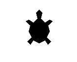

# Apresentando a tartaruga artista

<div style="display: flex; align-items: center;">
    
    <p>Oi, eu sou uma artista, você pode escrever código para me fazer
        desenhar quase qualquer coisa.</p>
</div>

Brinque com os blocos na caixa de ferramentas para ver o que eles fazem!

Este exercício também será o seu parque de diversões. Volte aqui sempre
que aprender um novo truque ou sempre que quiser.


## Caixa de ferramentas

```import turtle```

```artista = turtle.Turtle()```

```artista.shape('turtle')```

```artista.forward(100)```

```artista.left(90)```

```artista.right(90)```

```artista.color('red')```

```artista.penup()```

```artista.pendown()```

```for _ in range(4):```

```turtle.mainloop()```


## Código inicial

Copie e cole no seu editor, salve o arquivo e execute antes de fazer qualquer 
alteração.

```python

import turtle

artista = turtle.Turtle()

# Seu código a partir daqui

#artista.shape('turtle') # comece tirando o # no início dessa linha


# Instrução necessária para que a janela não se feche
turtle.mainloop()

```


[Próximo](03_L_invertido.md)
