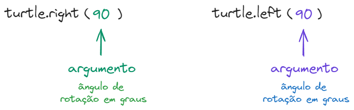
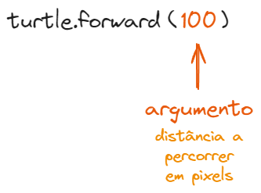

# Código desvendado

Nos exercícios anteriores, os números usados em ```artista.right(90)```,
```artista.left(90)```, ```artista.forward(100)```, entre outros são chamados
de **argumentos**. 

Em ```artista.right(90)```, o número `90` indica o *ângulo de rotação* em
graus. O mesmo vale para ```artista.left(90)```.



Em ```artista.forward(100)```, o número `100` indica a *distância* a ser
percorrida em pixels. 



Os argumentos permitem que um mesmo método ou função *tenha comportamentos 
diferentes*, dependendo do valor que passamos.

Até agora, usamos *valores fixos*, que chamamos de **literais**. Mas também
podemos usar *variáveis*, tornando o código mais flexível e dinâmico!

```python

import turtle

artista = turtle.Turtle()

lado_curto = 100
lado_longo = 200

artista.right(45)
artista.forward(lado_curto)
artista.right(90)
artista.forward(lado_longo)
artista.left(120)
artista.forward(lado_curto)

turtle.mainloop()
```

Além de funções e métodos, **também podemos passar argumentos para classes**. 
Quando criamos um novo objeto, os parênteses `()` podem receber valores serão
usados na configuração inicial desse objeto.

Por exemplo, a classe `Turtle` pode receber argumentos ao ser chamada:

```python
import turtle

artista = turtle.Turtle() # Criamos um objeto sem argumentos
outra_tartaruga = turtle.Turtle(shape='turtle') # Criamos outra já com formato específico
```

Aqui, passamos o argumento `shape='turtle'`, que define o formato da tartaruga.

Na verdade, qualquer objeto *chamável* (funções, métodos, classes e outros)
pode receber argumentos. Isso permite escrever código mais reutilizável, 
personalizável e poderoso! 


[Anterior](07_plaquinha.md) | [Próximo](07_plaquinha.md)
