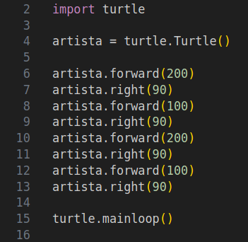

# Previsão

Olhe cuidosamente para o código abaixo.




O que acontece se ele for executado?

A) A artista desenhará um triângulo com três lados iguais.

B) O artista desenhará uma única linha.

C) O artista desenhará um quadrado.

D) O artista desenhará um retângulo.

Uso o código inicial para enviar sua resposta.


## Código inicial

```python

resposta = 'Escreva sua resposta aqui'
print(resposta)

```


[Anterior](09_triangulo.md)
