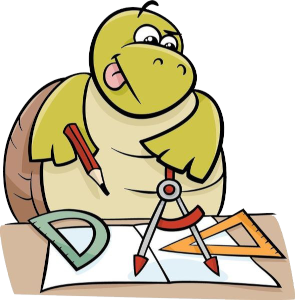
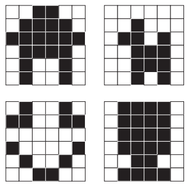

# Criando arte com código

Imagine que você seja um(a) piloto(a) de carro de corrida. Por causa da
quantidade de dados que os carros coletam e a necessidade de ter pessoas que
possam escrever programas para descobrir como continuar a melhorar a
performance deles, você nem se classificaria para a corrida se não tivesse
pessoas proficientes em ciência da computação.

Nesses desafios, você comandará uma tartaruga artista que usa um lápis para
desenhar formas diferentes. A artista vai desenhar uma linha por onde quer que
ela passe.

Para se mover na tela, você vai usar a instrução `Turtle.forward(100)`, que
diz para avançar 100 pixels. Pixels são, basicamente, quadradinhos muito
pequenos na tela do seu computador. Pixel é o menor ponto em que é possível
atribuir uma cor. Por exemplo, aqui vemos alguns desenhos possíveis caso a
tela do computador fosse um quadrado de 6 x 6 pixels. 

Uma outra instrução que temos nesses desafios diz para virar à direita ou à
esquerda. `Turtle.right(90)` é uma curva de 90 graus para a direita.
`Turtle.left(120)` é uma curva de 120 graus para a esquerda. Então, você pode
brincar com o quanto deseja que a artista vire. Aqui temos uma artista
avançando 100 pixels e virando 90 graus para a direita por 4 vezes até
desenhar um quadrado.

Você pode alterar as quantidades de pixels e graus alterando os números entre
os parênteses. Além de usar tantas outras instruções válidas. Divirta-se
desenhando com sua artista!

[Próximo](02_sou_um_artista.md)
