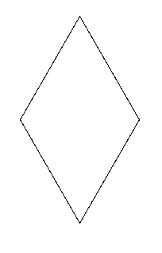

# Diamante

Desenhe um diamante com ângulos de 120 e 60 graus, e com lados de 150 pixels de comprimento.

## Figura a ser desenhada


## Caixa de ferramentas

```import turtle```

```diamante = turtle.Turtle()```

```diamante.forward(???)```

```diamante.left(???)```

```diamante.right(???)```

```turtle.mainloop()```

## Código inicial

```python

import turtle

diamante = turtle.Turtle()

# Seu código a partir daqui


# Instrução necessária para que a janela não se feche
turtle.mainloop()

```

| [Próximo](01_diamante.md)
