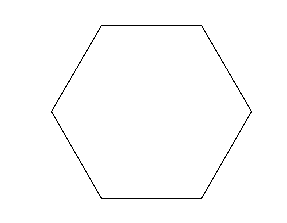

# Hexágono

Desenhe um hexágono com lados de 100 pixels e ângulos de 60 graus.


## Figura a ser desenhada



## Caixa de ferramentas

```import turtle```

```hexagono = turtle.Turtle()```

```hexagono.forward(???)```

```hexagono.left(???)```

```hexagono.right(???)```

```turtle.mainloop()```


## Código inicial

```python

import turtle

hexagono = turtle.Turtle()

# Seu código a partir daqui


# Instrução necessária para que a janela não se feche
turtle.mainloop()

```


[Anterior](01_diamante.md) | [Próximo](02_hexagono.md)
