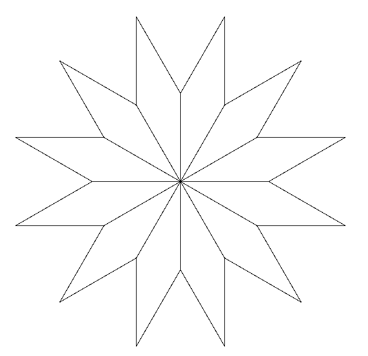

# Flor de diamantes

A partir do diamante, consegue fazer uma flor com 12 pétalas?

## Figura a ser desenhada



## Caixa de ferramentas

```import turtle```

```diamante = turtle.Turtle()```

```diamante.forward(???)```

```diamante.left(???)```

```diamante.right(???)```

```turtle.mainloop()```


## Código inicial

Código-resposta para o exercício do diamante.


[Anterior](02_hexagono.md) | [Próximo](03_flor_diamante.md)
