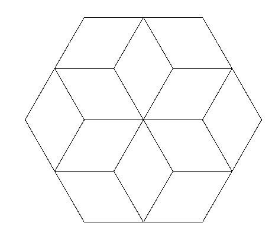

# Hexágono de hexágonos

Desenhe um hexágono estilizado a partir do hexágono feito anteriormente.

Este hexágono maior é feito com 6 hexágonos simples. Entre cada hexágono é
necessário fazer uma rotação. Quantos graus você terá que virar de cada vez?
Dica: divida o número de graus de um círculo pelo número de hexágonos.


## Figura a ser desenhada



## Caixa de ferramentas

```import turtle```

```hexagono = turtle.Turtle()```

```hexagono.forward(???)```

```hexagono.left(???)```

```hexagono.right(???)```

```turtle.mainloop()```


## Código inicial

Código-resposta do exercício do hexágono.


[Anterior](03_flor_diamante.md) | [Próximo](05_mais_uma_flor.md)
