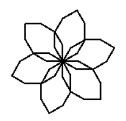

# Mais uma flor

Consegue fazer mais essa flor? 

Dica: comece pensando e fazendo uma pétala por vez.
Não esqueça da rotação entre cada pétala.

## Figura a ser desenhada



## Caixa de ferramentas

```import turtle```

```flor = turtle.Turtle()```

```flor.forward(???)```

```flor.left(???)```

```flor.right(???)```

```turtle.mainloop()```


## Código inicial

Sem código inicial


[Anterior](04_hexagono_hexagonos.md) | [Próximo](05_mais_uma_flor.md)
