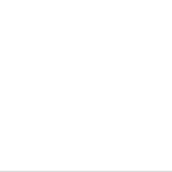

# Hora do show!

Até agora, vimos como controlar os dançarinos com as **teclas do teclado**.
Mas e se a dança começasse sozinha, seguindo o ritmo da música?

É isso que vamos explorar agora: eventos que são ativados com base na
**passagem do tempo**.

Na música, os dançarinos costumam contar os **tempos** para saber quando
entrar em cena. A maioria das músicas populares segue um padrão chamado
**compasso**, que normalmente tem quatro tempos. Você já deve ter ouvido alguém contando: “um, dois, três, quatro…” antes de começar a dança. Isso é um compasso!

Na nossa festa dançante, 1 compasso equivale a 1 segundo.

Usaremos uma função especial que diz:
🎶 “Espere quatro compassos… agora dance!”

```python
turtle.ontimer(dançarino.ação, milissegundos)
```

Essa função permite que você diga ao seu dançarino para esperar um tempo específico antes de iniciar um movimento. É como se ele estivesse ouvindo a batida, se preparando — e aí, no tempo certo… BAM! Começa a coreografia.

Observe que o tempo deve ser passado em milisegundos, portanto se você quer que o 
dançarino faça um rodopio até 4 segundos, deve fazer:

```python
turtle.ontimer(dançarino.faz_rodopio, 4000)
```

Fique atento ao contador de compassos na tela e pense:
🎧 “Quando é a hora certa de fazer esse dançarino brilhar?”




## Caixa de ferramentas

`import festa_dançante`

`dançarino = festa_dançante.cria_dançarino('Principal', 'Centro')`

`dançarino.anda_direita(???, ???)`

`dançarino.anda_esquerda(???, ???)`

`dançarino.aleatório()`

`dançarino.balança()`

`dançarino.faz_rodopio()`

`dançarino.move()`

`turtle.onkey(???, ???)`

`turtle.ontimer(???, ???)`


## Código inicial

```python
import turtle

import festa_dançante

dançarino = festa_dançante.cria_dançarino('turtle', 'Centro')

turtle.ontimer(None, 4000)

turtle.mainloop()
```

[Anterior](04_dois_dançarinos.md) | [Próximo](06_vamos_curtir.md)
