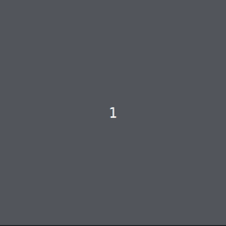

# Vamos curtir

Agora, adicione um bloco `turtle.ontimer` e faça seu dançarino(a) iniciar/fazer
um novo movimento após 6 compassos.

Neste exemplo, ele/ela começa a se movimentar pelo palco, mas a sua pode fazer
outro passo. Por exemplo, usar o novo método `dançarino.muda_cor`.




## Caixa de ferramentas

`import turtle, festa_dançante`

`dançarino = festa_dançante.cria_dançarino("Principal", "Centro")`

`dançarino.anda_direita()`

`dançarino.anda_esquerda()`

`dançarino.aleatório()`

`dançarino.balança()`

`dançarino.faz_rodopio()`

`dançarino.muda_cor()`

`dançarino.move()`

`turtle.onkey(???, ???)`

`turtle.ontimer(???, ???)`


## Código inicial

```python
# a partir do anterior
import turtle

import festa_dançante

dançarino = festa_dançante.cria_dançarino("Principal", "Centro")

turtle.ontimer(dançarino.faz_rodopio, 4000)

```


[Anterior](05_compassos.md) | [Próximo](07_grupo_dançarinos.md)
