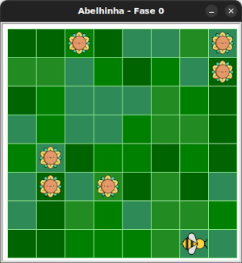

# Maia, a abelhinha

<div style="display: flex; align-items: center;">
    
    <p>Neste mundo, ajudaremos <strong>Maia</strong>, a abelhinha, a coletar
        néctar e a fazer mel.
    </p>
</div>

Mas antes, vamos conhecer outro conceito do Python: **pacotes**.


## Pacotes

Anteriormente, vimos o conceito de **módulos**, que servem para organizar
elementos de código e reutilizá-los em outros programas. Mas e se tivermos
muitos módulos? Como eles são organizados?

Os módulos são organizados em **pacotes**. Enquanto módulos são arquivos Python,
pacotes são **pastas** (diretórios) que contêm esses módulos, além de outros
arquivos úteis, como imagens, sons ou dados.

Um pacote pode conter **outros pacotes** dentro dele. Chamamos isso de
**subpacotes**.

Por exemplo, considere a seguinte estrutura de diretórios e arquivos:

```
meu_projeto/
├── atores/
│   ├── atores.py
│   └── mundo.py
├── fase01/
│   └── fase01.py
└── principal.py
```

Neste exemplo:

- `atores` e `fase01` são pacotes. Diretórios dentro deles seriam subpacotes.
- `atores.py`, `mundo.py` e `fase01.py` são módulos.
- Em `principal.py`, podemos importar assim:

```python
from fase01.fase01 import Abelha
from atores import atores
```

**Por que usar pacotes?**

- Para **organizar melhor** seu código.
- Para **evitar conflitos com nomes repetidos** entre módulos.
- Para **separar responsabilidades** em partes reutilizáveis.

As suas soluções para os desafios deste mundo deverão se colocados no diretório
raiz do pacote, dessa forma (os nomes são ilustrativos):

```
meu_projeto/
├── atores/
│   ├── atores.py
│   └── mundo.py
└── fase01/
│   ├── fase01.py
│   └── codigo_inicial.py
├──solucao_fase01.py
├──solucao_fase02.py
└──solucao_fase**.py
```

Agora avance você para a fase 1 para começar a praticar.

## 🐝 Sua vez de praticar


1. Crie uma pasta onde você colocará todos seus exercícios.
1. Faça o download do pacote kareto [clicando aqui](https://github.com/adorilson/kareto/releases/download/v0.1/kareto.zip).
1. Descompacte o pacote na mesma pasta criada anteriormente.
1. Abra essa pasta no VS Code.
1. Copie o código inicial deste exercício.
1. Crie um novo arquivo no VS Code e cole o código inicial nele.
1. Salve este arquivo na pasta criada.
1. Execute o arquivo e veja a abelhinha Maia em um campo de girassóis.

Se tudo deu certo, você verá um campo semelhante a este:



### Sua estrutura de pastas e arquivos deverá ser semelhante a essa:
```
sua_pasta_principal/
├── kareto/
│    ├── atores/
│    ├── fase00/
│    ├── fase01/
│    └── fase**/
├──solucao_fase00.py
├──solucao_fase01.py
└──solucao_fase**.py
```

A pasta do pacote `kareto` e todos seus subpacotes e módulos deverão ter
exatamente esses nomes, já os arquivos com os seus exercicios
(`solucao_fase**.py`) poderão ter outros nomes, mas fica essa sugestão de
organização.


## 🧰 Caixa de ferramentas

`import turtle`

`from kareto import fase00`

`turtle.mainloop()`


## 💻 Código inicial

```python
import turtle

from kareto import fase00


turtle.mainloop()

```

[Próximo](fase01/README.md)

