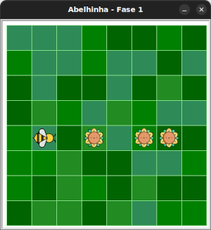
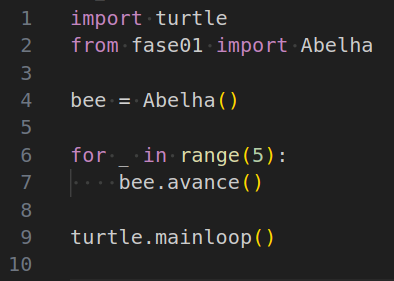

# Coletando néctar: previsão

Considerando o seguinte cenário:



O que você acha que vai acontecer quando você executar o código abaixo?



<!-- para a lista ser A, B, C, D -->
<style type="text/css">
    ol { list-style-type: upper-alpha; }
</style>

1) Maia não irá se mover
1) Maia irá se mover apenas um espaço
1) Maia irá se mover 5 vezes e pegará nectar de todas os girassóis
1) Maia moverá apenas 3 espaços


## 🐝 Sua vez de praticar

Use o código inicial para enviar sua resposta.


## 🧰 Caixa de ferramentas

`resposta = "Escreva sua resposta aqui"`

`print(resposta)`


## 💻 Código inicial

```python
resposta = "Escreva sua resposta aqui"
print(resposta)
```


[Anterior](../fase01/README.md) | [Próximo](../fase03/README.md)
