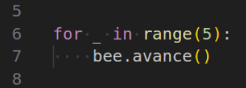

# Laços de repetição com Bee


Na fase anterior, você teve um primeiro contato com um novo bloco da linguagem
Python:



Neste caso, o Python está sendo instruído a repetir **5 vezes** a instrução
`bee.avance()`.

Note que os **pontos** entre as palavras no exemplo **não devem ser 
digitados**. Eles estão apenas substituindo os espaços para você perceba que
na linha imediatamente abaixo do `for` existem **`4` espaços** antes da instrução. Isso é o que chamamos de **indentação**.

Se a indentação estiver incorreta ou ausente, o Python mostrará uma mensagem 
de erro parecida com esta:

```python
  File "fase02.py", line 7
    bee.avance()
    ^
IndentationError: expected an indented block after 'for' statement on line 6
```

Nesse caso, ele diz que, na linha `7`, era esperado um **bloco indentado**
logo após a instrução for da linha `6`.

A indentação é o que **informa ao Python quais instruções fazem parte do bloco
de repetição**. Vamos voltar a falar disso mais adiante.

Outro erro comum é esquecer os **dois pontos (`:`)** ao final da linha do 
`for`. Nesse caso, ocorre um erro de sintaxe, como este:

```python
File "fase02.py", line 6
    for n in range(5)
                     ^
SyntaxError: expected ':'
```

Aqui, o Python está dizendo que esperava dois pontos (`:`) no final da linha
6, e marca o local exato com o acento circunflexo (`^`).

Agora é sua vez de brincar com esse novo bloco de repetição, que tem a seguinte estrutura (sintaxe):

```python
for n in range(???):
    <instruções aqui>
```
As instruções colocadas no lugar de `<instruções aqui>` serão repetidas o 
número de vezes indicado no lugar de `???`:

- **`for`** e **`in`** são **palavras reservadas** da linguagem — você não
pode usá-las como identificados.
- **`n`** é uma **variável temporária**, que só existe enquanto o laço `for` 
está rodando.
- **`range`** é uma **função embutida** da linguagem

Mais adiante veremos outras formas de usar esses mesmo elementos.

## Sua vez de praticar

O código-inicial desta fase resgate o que você fez na fase 1. Faça a abelhinha avançar por todas os girassóis — mas desta vez usando a instrução
`for n in range(5):`


## Caixa de ferramentas

### Mundo (turtle)

- `import turtle`

- `turtle.mainloop()`

### Abelhinha

- `import fase01`

- `bee = fase01.Abelha()`

- `bee.avance()`

### Repetição (Python)

- `for n in range(???):`


## Código inicial

```python
# a partir da solução do aluno para a fase 1
import turtle
from fase01 import Abelha

bee = Abelha()

## Seu código a partir aqui

bee.avance()
bee.avance()
bee.avance()
bee.avance()
bee.avance()

# Fim do seu código aqui

turtle.mainloop()

```


[Anterior](../fase02/README.md) | [Próximo](../fase03/README.md)
