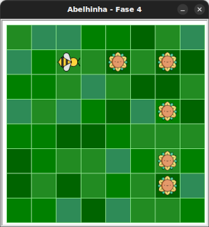

# Virando à direita

**Bee** tem agora um novo método: `direita()`, que faz com que ela vire à
direita. Diferente do comando `right()` da tartaruga, este não recebe
argumentos. A rotação é sempre de `90` graus.

## 🐝 Sua vez de praticar

Com este novo método, e dois laços de repetição, ajude **Bee** a colher todo o
néctar do jardim usando o menor número possível de instruções.





## 🧰 Caixa de ferramentas

### Mundo (turtle)

- `import turtle`

- `turtle.mainloop()`

### Abelhinha

- `from fase04 import Abelha`

- `bee = Abelha()`

- `bee.avance()`

- `bee.direita()`

### Repetição (Python)

- `for n in range(???):`


## 💻 Código inicial

```python
import turtle
from fase04 import Abelha

bee = Abelha()

## Seu código a partir aqui


# Fim do seu código aqui

turtle.mainloop()

```

[Anterior](../fase03/README.md) | [Próximo](../fase04/README.md)