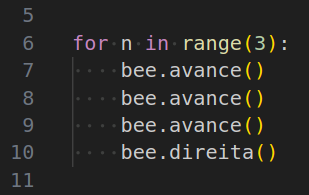
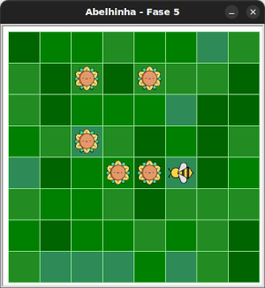

# Mais blocos dentro do laço

Laços funcionam também com mais de um bloco dentro!




## 🐝 Sua vez de praticar

Você consegue repetir a sequência do código inicial usando um laço?
Fique atento à indentação.




## 🧰 Caixa de ferramentas

### Mundo (turtle)

- `import turtle`

- `turtle.mainloop()`

### Abelhinha

- `from fase05 import Abelha`

- `maia = Abelha()`

- `maia.avance()`

- `maia.direita()`

### Repetição (Python)

- `for n in range(???):`


## 💻 Código inicial

```python
import turtle
from fase05 import Abelha

maia = Abelha()


maia.avance()
maia.avance()
maia.avance()
maia.direita()


turtle.mainloop()

```

[Anterior](../fase04/README.md) | [Próximo](../fase06/README.md)