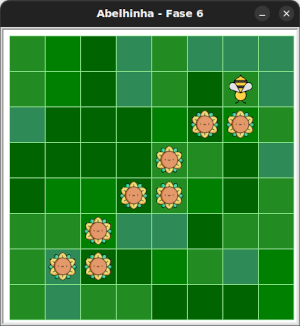

# Mais néctar para colher

A Maia precisará percorrer um longo caminho e fazer muitas
curvas para colher todo o néctar do jardim.

## 🐝 Sua vez de praticar

Você pode tentar pegar todo o néctar utilizando apenas um laço de repetição?
Tente ir programando para achar o bloco de repetição para colocar no laço
e quantas vezes o laço deve repetir.




## 🧰 Caixa de ferramentas

### Mundo (turtle)

- `import turtle`

- `turtle.mainloop()`

### Abelhinha

- `from fase06 import Abelha`

- `maia = Abelha()`

- `maia.avance()`

- `maia.direita()`

- `maia.esquerda()`

### Repetição (Python)

- `for n in range(???):`


## 💻 Código inicial

```python
import turtle
from fase06 import Abelha

maia = Abelha()


## Seu código a partir aqui


## Fim do seu código aqui


turtle.mainloop()
```

[Anterior](../fase05/README.md) | [Próximo](../fase07/README.md)