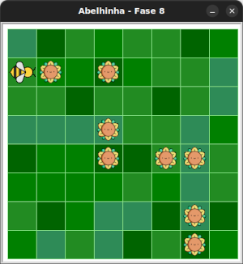

# O zigue-zague flórido

Hora de praticar seus movimentos em laços para um desafio complexo!

## 🐝 Sua vez de praticar

Maia precisa coletar todos os girassóis.
Você consegue guiar a Maia fazendo o menor caminho possível?




## 🧰 Caixa de ferramentas

### Mundo (turtle)

- `import turtle`

- `turtle.mainloop()`

### Abelhinha

- `from fase08 import Abelha`

- `maia = Abelha()`

- `maia.avance()`

- `maia.direita()`

- `maia.esquerda()`

### Repetição (Python)

- `for n in range(???):`


## 💻 Código inicial

```python
import turtle
from fase08 import Abelha

maia = Abelha()

## Seu código a partir aqui


# Fim do seu código aqui

turtle.mainloop()

```

[Anterior](../fase07/README.md) | [Próximo](../fase09/README.md) 