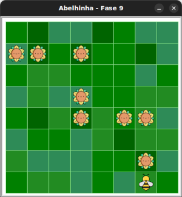

# Missão inversa!

Hora de inverter a lógica e coletar de baixo para cima!


## 🐝 Sua vez de praticar

Maia precisa coletar todos os girassóis, começando de uma nova posição e direção.
Você consegue guiar a Maia fazendo o menor caminho possível?




## 🧰 Caixa de ferramentas

### Mundo (turtle)

- `import turtle`

- `turtle.mainloop()`

### Abelhinha

- `from fase09 import Abelha`

- `maia = Abelha()`

- `maia.avance()`

- `maia.direita()`

- `maia.esquerda()`

### Repetição (Python)

- `for n in range(???):`


## 💻 Código inicial

```python
import turtle
from fase09 import Abelha

maia = Abelha()

## Seu código a partir aqui


## Fim do seu código aqui

turtle.mainloop()

```

[Anterior](../fase08/README.md) | [Próximo](../fase10/README.md)
