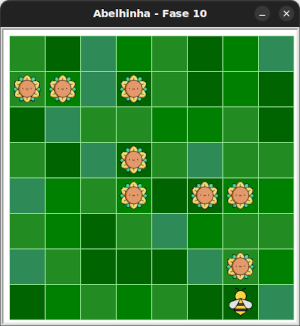
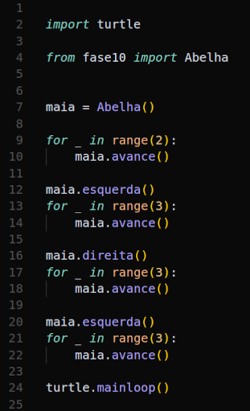

# Detetive de código: a aventura dos laços

Considerando o seguinte cenário:



O que você acha que vai acontecer quando você executar o código abaixo?



<!-- para a lista ser A, B, C, D -->
<style type="text/css">
    ol { list-style-type: upper-alpha; }
</style>


1) Maia irá muito longe no primeiro laço.
1) Maia não voará o suficiente no primeiro laço para pegar todo o néctar.
1) Maia irá coletar todo o néctar sem nenhum problema.
1) Maia irá virar na direção errada após a primeira repetição.

Use o código inicial para enviar sua resposta.


## 🐝 Sua vez de praticar

Use o código inicial para enviar sua resposta.


## 🧰 Caixa de ferramentas

`resposta = "Escreva sua resposta aqui"`

`print(resposta)`


## 💻 Código inicial

```python

resposta = "Escreva sua resposta aqui"
print(resposta)

```


[Anterior](../fase09/README.md)
