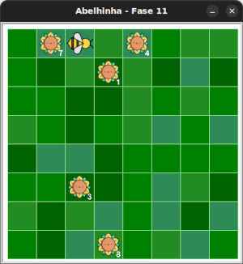

# Laços aninhados com Maia

Nas seções anteriores, você conheceu os **laços de repetição**, usando o bloco
`for _ in range(???):`. Também viu que é possível escrever **outros blocos**
dentro dele, desde que estejam corretamente **indentados**.
O que ainda não exploramos é que esses blocos internos podem ser **outros
laços de repetição**. Quando um laço está dentro de outro, dizemos que temos
**laços aninhados**. Este é o tópico principal deste novo mundo.


## 🐝 Sua vez de praticar


1. Crie uma pasta onde você colocará todos seus exercícios (ou use a anterior).
1. Faça o download do pacote kareto atualizado [clicando aqui](https://github.com/adorilson/kareto/releases/download/v0.2/kareto.zip).
1. Descompacte o pacote na mesma pasta criada anteriormente.
1. Abra essa pasta no VS Code.
1. Copie o código inicial deste exercício.
1. Crie um novo arquivo no VS Code e cole o código inicial nele.
1. Salve este arquivo na pasta criada.
1. Execute o arquivo e veja que agora os girassóis possum um número indicando
a quanto de néctar que pode ser colhido.

Se tudo deu certo, você verá um jardim semelhante a este:



## 🧰 Caixa de ferramentas

`import turtle`

`from kareto import fase11`

`turtle.mainloop()`


## 💻 Código inicial

```python
import turtle

from kareto import fase11


turtle.mainloop()

```

[Próximo](fase12/README.md)

