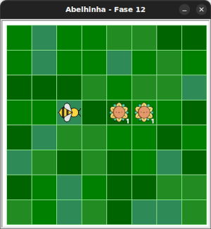

# Coletando néctar

Com a nova instrução `maia.obtenha_nectar()` ajude Maia a coletar todo o néctar do jardim.

## 🐝 Sua vez de praticar

Tente resolver esse desafio com no máximo 5 instruções. Contando apenas aqueles
depois de `maia = Abelha()` e antes de `turtle.mainloop`.




## 🧰 Caixa de ferramentas

### Mundo (turtle)

- `import turtle`

- `turtle.mainloop()`

### Abelhinha

- `from fase12 import Abelha`

- `maia = Abelha()`

- `maia.avance()`

- `maia.direita()`

- `maia.esquerda()`

- `maia.obtenha_nectar()`

### Repetição (Python)

- `for n in range(???):`


## 💻 Código inicial

```python
import turtle
from fase12 import Abelha

maia = Abelha()

## Seu código a partir aqui


# Fim do seu código aqui

turtle.mainloop()

```

[Anterior](../README.md) | [Próximo](../fase13/README.md)