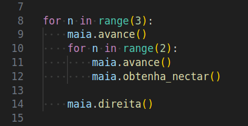
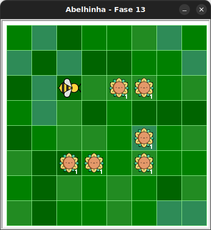

# Laços aninhados

Copiando e executando o código inicial deste exercício.

Observe que Maia pega todo o néctar do jardim, mas para isso
foram escritos `3` laços `for n in range(???)` exatamente iguais,
e com as mesmas instruções (`maia.avance` e `maia.direita()`) antes
e depois deles.

Consegues melhorar isso?

## 🐝 Sua vez de praticar

Reescreva o código de forma que o bloco formado pelo laço de repetição e as instruções
em torno deles estejam dentro de outro laço de repetição. Fica semelhante a isto:



Muita atenção à indentação! Observe que cada nível de indentação é definido
com `4` espaços.




## 🧰 Caixa de ferramentas

### Mundo (turtle)

- `import turtle`

- `turtle.mainloop()`

### Abelhinha

- `from fase13 import Abelha`

- `maia = Abelha()`

- `maia.avance()`

- `maia.direita()`

- `maia.esquerda()`

- `maia.obtenha_nectar()`

### Repetição (Python)

- `for n in range(???):`


## 💻 Código inicial

```python
import turtle
from fase13 import Abelha

maia = Abelha()

## Seu código a partir daqui

maia.avance()
for n in range(2):
    maia.avance()
    maia.obtenha_nectar()

maia.direita()

maia.avance()
for n in range(2):
    maia.avance()
    maia.obtenha_nectar()

maia.direita()

maia.avance()
for n in range(2):
    maia.avance()
    maia.obtenha_nectar()

maia.direita()

# Fim do seu código aqui

turtle.mainloop()

```

[Anterior](../fase12/README.md) | [Próximo](../fase14/README.md)