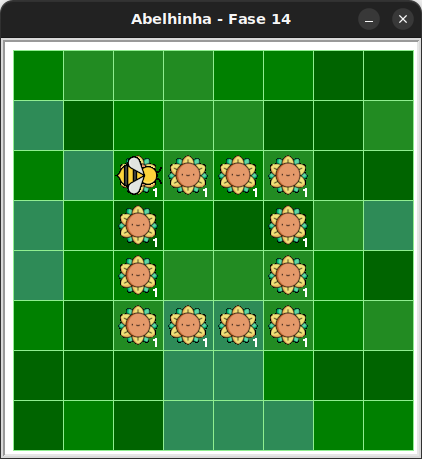

# Laços aninhados mais longos

Muito néctar pra Maia recolher.

## 🐝 Sua vez de praticar

Dessa vez, ajude Maia a coletar todo o néctar utilizando o menor número possível de blocos. Tente usar apenas 2 blocos `maia.avance()` e 2 `for _ in range(???):`




## 🧰 Caixa de ferramentas

### Mundo (turtle)

- `import turtle`

- `turtle.mainloop()`

### Abelhinha

- `from fase14 import Abelha`

- `maia = Abelha()`

- `maia.avance()`

- `maia.direita()`

- `maia.esquerda()`

- `maia.obtenha_nectar()`

### Repetição (Python)

- `for n in range(???):`


## 💻 Código inicial

```python
import turtle
from fase14 import Abelha

maia = Abelha()

# Seu código a partir daqui


# Fim do seu código aqui

turtle.mainloop()

```

[Anterior](../fase13/README.md) | [Próximo](../fase15/README.md)