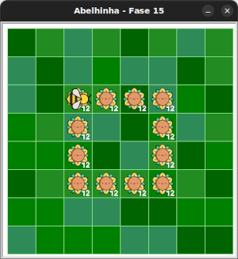

# Desafio quebra-cabeça

Desafios de quebra-cabeça são exercícios projetados para expandir seu cérebro!
Faça o melhor que você pode!


## 🐝 Sua vez de praticar

- **Desafio**: Descubra como pegar todo o nectar utilizando apenas os blocos disponíveis.




## 🧰 Caixa de ferramentas

Os números entre os parênteses na frente dos blocos indicam a quantidade máxima
que você deve usar daquele bloco.

### Mundo (turtle)

- `import turtle`

- `turtle.mainloop()`

### Abelhinha

- `from fase15 import Abelha`

- `maia = Abelha()`

- `maia.avance()` (2)

- `maia.direita()`

- `maia.esquerda()`

- `maia.obtenha_nectar()` (1)

### Repetição (Python)

- `for n in range(???):` (3)


## 💻 Código inicial

```python
import turtle
from fase15 import Abelha

maia = Abelha()

## Seu código a partir daqui


# Fim do seu código aqui

turtle.mainloop()

```

[Anterior](../fase14/README.md) | [Próximo](../fase16/README.md)