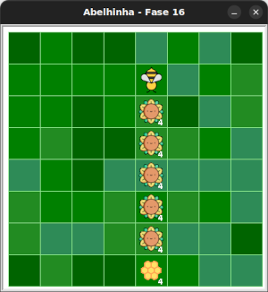

# Colete néctar e produza mel

Maia tem agora um novo bloco: `faça_mel()`.

## 🐝 Sua vez de praticar

Colete todo o néctar de cada flor e produza mel na colmeia.

Use laços aninhados e no máximo 8 blocos.



## 🧰 Caixa de ferramentas

### Mundo (turtle)

- `import turtle`

- `turtle.mainloop()`

### Abelhinha

- `from fase16 import Abelha`

- `maia = Abelha()`

- `maia.avance()`

- `maia.direita()`

- `maia.esquerda()`

- `maia.obtenha_nectar()`

- `maia.faça_mel()`

### Repetição (Python)

- `for n in range(???):`


## 💻 Código inicial

```python
import turtle
from fase16 import Abelha

maia = Abelha()

# Seu código a partir daqui


# Fim do seu código aqui

turtle.mainloop()

```

[Anterior](../fase15/README.md) | [Próximo](../fase17/README.md)