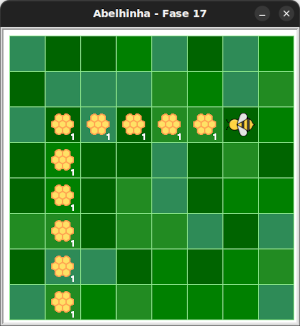

# Jardim cheio de colméias

Faça todo o mel possível.

## 🐝 Sua vez de praticar

Faça todo o mel possível usando apenas uma instrução `maia.faça_mel()` e no
máximo 5 instruções no total.



## 🧰 Caixa de ferramentas

### Mundo (turtle)

- `import turtle`

- `turtle.mainloop()`

### Abelhinha

- `from fase17 import Abelha`

- `maia = Abelha()`

- `maia.avance()`

- `maia.direita()`

- `maia.esquerda()`

- `maia.obtenha_nectar()`

- `maia.faça_mel()`

### Repetição (Python)

- `for n in range(???):`


## 💻 Código inicial

```python
import turtle
from fase17 import Abelha

maia = Abelha()

## Seu código a partir daqui


# Fim do seu código aqui

turtle.mainloop()

```

[Anterior](../fase16/README.md) | [Próximo](../fase18/README.md)