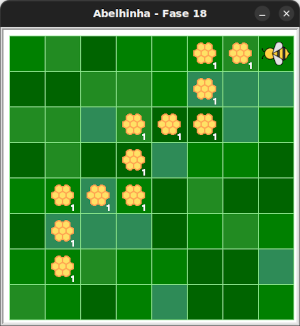
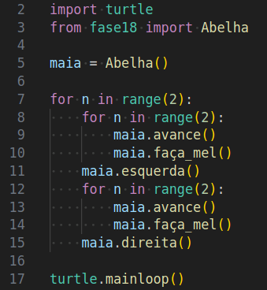

# Detetive de código: a aventura dos laços aninhados

Considerando o seguinte jardim:



Quanto mel a Maia fará quando executar o código abaixo?



<!-- para a lista ser A, B, C, D -->
<style type="text/css">
    ol { list-style-type: upper-alpha; }
</style>


1) 4
1) 8
1) 10
1) 12

Use o código inicial para enviar sua resposta.


## 🐝 Sua vez de praticar

Use o código inicial para enviar sua resposta.


## 🧰 Caixa de ferramentas

`resposta = "Escreva sua resposta aqui"`

`print(resposta)`


## 💻 Código inicial

```python

resposta = "Escreva sua resposta aqui"
print(resposta)

```


[Anterior](../fase17/README.md)