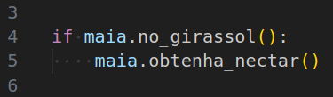
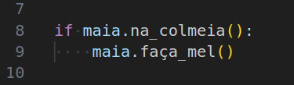
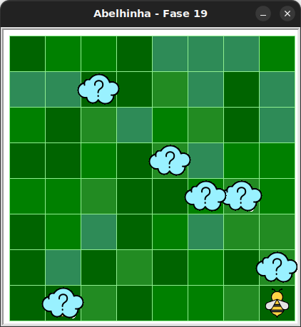

# Instruções condicionais com Maia


Este é um bloco condicional:



O código dentro de um bloco condicional (delimitado pela indentação)
é executado apenas se uma **condição** é **verdadeira**. 

Em desafios com condicionais, podemos querer verificar uma condição,
como **se** Maia está em um girassol ou na colmeia. E então colher néctar
ou fazer mel.

Você pode usar condicionais em muitas maneiras diferentes como essa:




## 🐝 Sua vez de praticar

1. Crie uma pasta onde você colocará todos seus exercícios (ou use a anterior).
1. Faça o download do pacote kareto atualizado [clicando aqui](https://github.com/adorilson/kareto/releases/download/v0.3/kareto.zip).
1. Descompacte o pacote na mesma pasta criada anteriormente.
1. Abra essa pasta no VS Code.
1. Copie o código inicial deste exercício.
1. Crie um novo arquivo no VS Code e cole o código inicial nele.
1. Salve este arquivo na pasta criada.
1. Execute o arquivo e veja que agora há nuvens, que podem
encobrir um girassol, uma colmeia ou nada. 

Se tudo deu certo, você verá um jardim semelhante a este:



Você não sabe se haverá uma colmeia ou uma flor até que o código seja executado.

## 🧰 Caixa de ferramentas

`import turtle`

`from kareto import fase19`

`turtle.mainloop()`


## 💻 Código inicial

```python
import turtle

from kareto import fase19


turtle.mainloop()

```

[Próximo](kareto/fase20/README.md)

