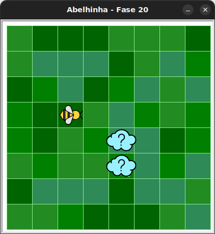

# Mais nuvens!

As nuvens podem ou não esconder algo.

## 🐝 Sua vez de praticar

Verifique abaixo de cada nuvem e observe se ela está escondendo um girassol
antes de colher o néctar. Se existir um girassol abaixo da nuvem, Maia vai precisar colher néctar uma vez. 



Você não sabe se haverá embaixo da nuvem até que o código seja executado.

## 🧰 Caixa de ferramentas

### Mundo (turtle)

- `import turtle`

- `turtle.mainloop()`

### Abelhinha

- `from kareto.fase20 import Abelha`

- `maia = Abelha()`

- `maia.avance()`

- `maia.direita()`

- `maia.esquerda()`

- `maia.obtenha_nectar()`

- `maia.faça_mel()`

- `maia.na_colmeia()`

- `maia.no_girassol()`

### Repetição (Python)

- `for n in range(???):`

### Condicional (Python)

- `if maia.na_colmeia():`

- `if maia.no_girassol():`


## 💻 Código inicial

```python
import turtle

from kareto.fase20 import Abelha

maia = Abelha()

# Seu código aqui


# Fim do seu código

turtle.mainloop


```

[Anterior](../../README.md) [Próximo](kareto/fase20/README.md)

