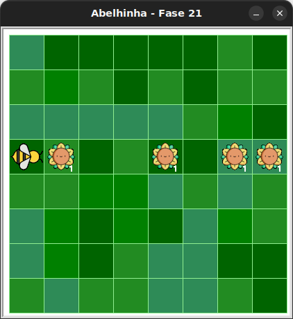

# Girassóis em linha!

Agora, a abelha deve coletar néctar de girassóis posicionados em sequência.

## 🐝 Sua vez de praticar

Programe a abelha para andar para frente e colher o néctar dos girassóis que encontrar pelo caminho. Uso no máximo 5 blocos!

Dica: use condicional dentro de laço de repetição e cuidado com a indentação.



## 🧰 Caixa de ferramentas

### Mundo (turtle)

- `import turtle`

- `turtle.mainloop()`

### Abelhinha

- `from kareto.fase21 import Abelha`

- `maia = Abelha()`

- `maia.avance()`

- `maia.direita()`

- `maia.esquerda()`

- `maia.obtenha_nectar()`

- `maia.faça_mel()`

- `maia.na_colmeia()`

- `maia.no_girassol()`

### Repetição (Python)

- `for n in range(???):`

### Condicional (Python)

- `if maia.na_colmeia():`

- `if maia.no_girassol():`


## 💻 Código inicial

```python
import turtle

from kareto.fase21 import Abelha

maia = Abelha()

# Seu código aqui


# Fim do seu código

turtle.mainloop


```


[Anterior](../fase20/README.md) | [Próximo](../fase22/README.md)
