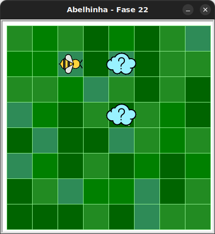

# Agora eu só quero fazer mel

## 🐝 Sua vez de praticar

Algumas das nuvens podem possuir colmeias abaixo delas. Certifique-se de que
a colmeia está escondida atrás de cada nuvem. Se existir uma colmeia, a abelha
só precisará fazer mel uma vez.

Use no máximo 6 blocos.



## 🧰 Caixa de ferramentas

### Mundo (turtle)

- `import turtle`

- `turtle.mainloop()`

### Abelhinha

- `from kareto.fase22 import Abelha`

- `maia = Abelha()`

- `maia.avance()`

- `maia.direita()`

- `maia.esquerda()`

- `maia.obtenha_nectar()`

- `maia.faça_mel()`

- `maia.na_colmeia()`

- `maia.no_girassol()`

### Repetição (Python)

- `for n in range(???):`

### Condicional (Python)

- `if maia.na_colmeia():`

- `if maia.no_girassol():`

## 💻 Código inicial

```python
import turtle
from kareto.fase22 import Abelha

maia = Abelha()

# Seu código aqui


# Fim do seu código

turtle.mainloop()

```

[Anterior](../fase21/README.md) | [Próximo](../fase23/README.md)
